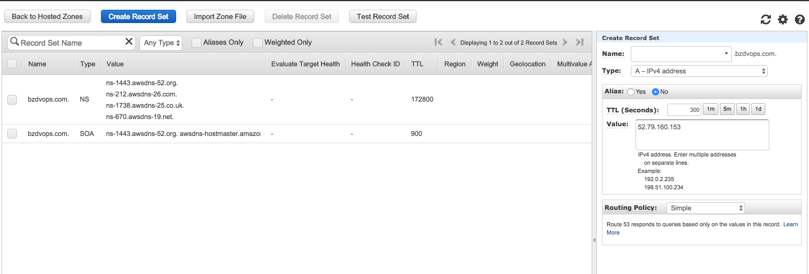

# 도메인 && 네트워크 준비

## 도메인 준비

다음의 도메인들을 준비하도록 합니다. 다음의 보기에서는 pas-mini.io 도메인을 소유했다고 가정하고, 다음의 A_Mask 들을 준비하도록 합니다.

 - gitlab, dcos 을 제외한 모든 도메인은 public-agent 서버로 연결토록 합니다.
 - gitlab 도메인은 gitlab 서버로, dcos 도메인은 마스터 노드 중 하나로 연결토록 합니다.
 - 외부 인터넷 환경에서 접속이 가능해야 하므로, 퍼블릭 아이피로 연결하도록 합니다.

| A_MASK        | 도메인      | 역할                   | 퍼블릭 아이피              |
|---------------|-------------|------------------------|----------------------------|
| gitlab        | pas-mini.io | 깃랩 / 도커 레지스트리 | 52.78.60.43(깃랩)       |
| dcos        | pas-mini.io | DC/OS 마스터 | 52.79.125.242(마스터)       |
| config        | pas-mini.io | 클라우드 콘피그 서버   | 52.79.51.79(public-agent) |
| eureka-server | pas-mini.io | 유레카 서버            | 52.79.51.79(public-agent) |
| iam       | pas-mini.io | 사용자 인증 서버       | 52.79.51.79(public-agent) |
| db       | pas-mini.io | 데이터베이스   | 52.79.51.79(public-agent) |
| cloud-server  | pas-mini.io | 클라우드 플랫폼 서버   | 52.79.51.79(public-agent) |
| cloud         | pas-mini.io | 클라우드 플랫폼 UI     | 52.79.51.79(public-agent) |
| nexus         | pas-mini.io | 넥서스 서버     | 52.79.51.79(public-agent) |

와일드카드(*) A_Mask 를 활용하실 경우, 다음과 같이 간략히 설정이 가능합니다.

| A_MASK        | 도메인      | 역할                   | 아이피/호스트              |
|---------------|-------------|------------------------|----------------------------|
| gitlab        | pas-mini.io | 깃랩 / 도커 레지스트리 | 52.78.60.43(gitlab)       |
| *        | pas-mini.io | 클라우드 콘피그 서버   | 52.79.51.79(public-agent) |


*Tip* AWS Route53 을 사용하실 경우의 설정 모습




## 호스트네임 변경

모든 서버에 각 역할에 맞는 호스트네임으로 변경합니다. 

예) bootstrap 서버

— RHEL : /etc/sysconfig/network 파일을 변경합니다.

```
sudo vi /etc/sysconfig/network

# 다음 한줄의 내용으로 교체
HOSTNAME=bootstrap

# 재시작
sudo reboot
```

— CENTOS : /etc/hostname 파일을 변경합니다.

```
sudo vi /etc/hostname

# 다음 한줄의 내용으로 교체
bootstrap

# 적용
sudo hostname bootstrap
```

*Tip*

- bootstrap
- master
- agent1
- agent2
- agent3
- agent4
- public
- pinpoint
- elk


## ssh root 접속 허용

 - 원할한 설치를 위해서 모든 서버에 root 권한으로 ssh 접속이 가능하도록 설정합니다.
 - 보안 이슈가 있을 경우 설치 후에는 설정을 원복하여도 됩니다.
 - 다음 두 파일의 PermitRootLogin 이 no 로 설정되어있을 경우, 주석처리를 하도록 합니다.
   - /etc/ssh/ssh_config
   - /etc/ssh/sshd_config
   
```
sudo vi /etc/ssh/ssh_config

(만일 위 파일에 PermitRootLogin 항목이 없으면
/etc/ssh/sshd_config 파일에 있음)
.
.
# PermitRootLogin no
.
.
sudo service sshd restart
```