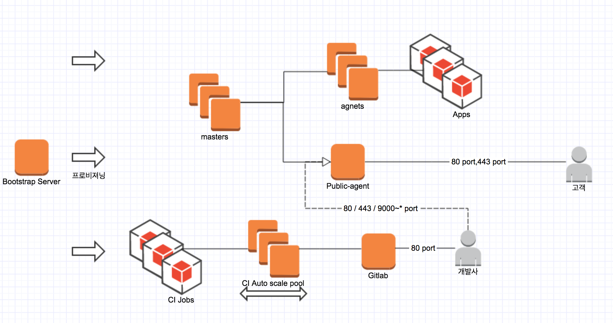
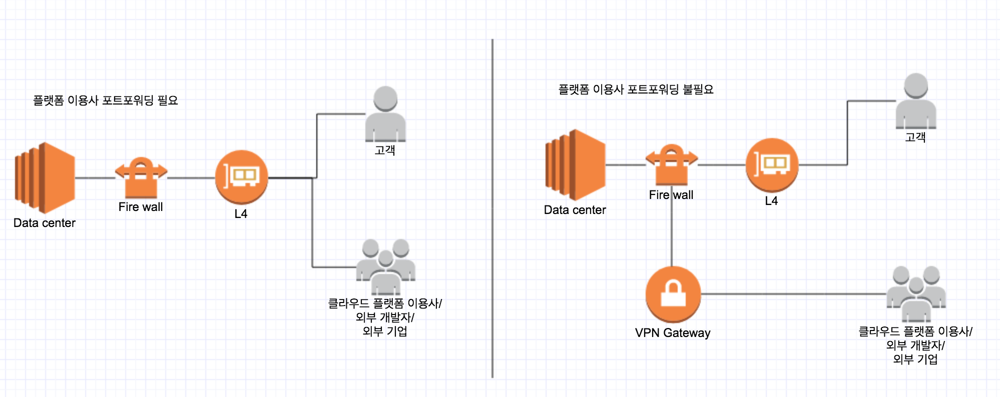

# 서버 준비

## 사전 준비 사항

 — 모든 노드는 CentOs/Rhel 7.2 ~ 7.3 OS 에서 구동됩니다.  
 - 내부망 UDP 뚤려있을것: UDP 가 뚤려있지 않으면 53 포트 domain resolve 가 작동하지 않는다. (운영시)
 - 내부망 TCP 포트는 모두 뚤려있을것 (운영시)
 - 인터넷 접속 가능한 환경일 것(설치시)
 - 네임서버 :  *.[ server ].[ domain ] 형식으로, A MASK 가  *  로 설정된 도메인을 보유하고있을것. (운영시)
 - 모든 서버는 동일한 pem 파일로 ssh 가 가능할 것. (운영시)
 - 모든 서버의 /etc/ssh/ssh_config 는 PermitRootLogin (설치시) 을 허용할 것.

<서버 준비 개념도>

 
## 서버 준비(데이터 센터 기준)

- 다음의 서버들을 준비해야 합니다. (사양은 추천사항입니다.)
    - 부트스트랩 노드 하나.
    - 깃랩 노드 하나.
    - ci 서버 노드 하나.
    - 마스터 노드는 홀수개의 서버로 준비하도록 합니다. (1,3,5)
    - 프라이빗 에이전트 노드는 최소 두개를 구성해야 합니다.
    - 퍼블릭 에이전트 노드는 최소 한개를 구성해야 합니다.
    
- 데이터 센터 스위치 또는 방화벽에서 다음의 포트를 구성하도록 합니다.    
    - 퍼블릭 에이전트 노드의 80 포트와 443 포트, 그리고 9000 - 60000 (허용 최대치) 포트는 외부에서 접속이 가능해야 합니다.
    - 마스터 노드중 한개의 80 포트는 외부에서 접속이 가능해야 합니다.
    - 깃랩 서버의 80 포트와 5000 포트는 외부에서 접속이 가능해야 합니다.
    - 깃랩 서버, 퍼블릭 에이전트 노드, 그리고 한개의 마스터 노드는 인터넷 환경에서 접속 가능한 퍼블릭 아이피를 가지고 있어야 합니다.
    
- 데이터 센터가 보유한 네임서버에 *.[ server ].[ domain ]  형식으로, A MASK 가  *  로 설정된 도메인을 등록하셔야 합니다.
- 데이터 센터가 보유한 네임서버가 없다면, [DNS Server(Expert)](additional-dns.md) 섹션을 참조하여 네임서버를 구축하도록 합니다.

### 서버 예시(데이터 센터 구성도)

- 데이터 센터 - 클라우드 플랫폼 이용사간 포트포워딩 제약시

| 역할 / 호스트네임 | 사양                     | IP 주소      | 퍼블릭 IP 주소 | 외부 포트바인딩     |
|-------------------|--------------------------|--------------|----------------|---------------------|
| bootstrap         | 2 CPU /2 GB/100 GB Disk  | 172.31.8.143 |                |                     |
| master1           | 2 CPU /4 GB/100 GB Disk  | 172.31.12.143 | 52.79.125.242  | 80                  |
| master2           | 2 CPU /4 GB/100 GB Disk  | 172.31.4.125 |                |                     |
| master3           | 2 CPU /4 GB/100 GB Disk  | 172.31.1.198  |                |                     |
| public-agent      | 4 CPU /8 GB/100 GB Disk  | 172.31.5.136 | 52.79.51.79    | 80,443,9000 - 60000 |
| agent1            | 4 CPU /8 GB/100 GB Disk  | 172.31.6.35 |                |                     |
| agent2            | 4 CPU /8 GB/100 GB Disk  | 172.31.1.235 |                |                     |
| agent3            | 4 CPU /8 GB/100 GB Disk  | 172.31.5.245 |                |                     |
| agent4            | 4 CPU /8 GB/100 GB Disk  | 172.31.14.247 |                |                     |
| agent5            | 4 CPU /8 GB/100 GB Disk  | 172.31.7.160 |                |                     |
| agent6            | 4 CPU /8 GB/100 GB Disk  | 172.31.11.70 |                |                     |
| agent7            | 4 CPU /8 GB/100 GB Disk  | 172.31.0.164 |                |                     |
| gitlab            | 4 CPU /32 GB/300 GB Disk | 172.31.15.249 | 52.78.60.43    | 80,5000             |
| ci                | 1 CPU /1 GB/100 GB Disk  | 172.31.3.61 |                |                     |

- 데이터 센터 - 클라우드 플랫폼 이용사간 포트포워딩 제약 없을시

만일 어플리케이션 서비스만 고객에게 노출되고, 개발자들이 클라우드 플랫폼과 깃랩(개발자 포털) 서비스를 데이터 센터 내부망으로만 접속을 허용할 경우,
`master1` , `gitlab` 서버는 별도의 퍼블릭 IP와 포트바인딩이 필요하지 않습니다. (`public-agent` 또한 80,443 포트바인딩만 필요하게 됩니다.)

| 역할 / 호스트네임 | 사양                     | IP 주소      | 퍼블릭 IP 주소 | 외부 포트바인딩     |
|-------------------|--------------------------|--------------|----------------|---------------------|
| master1           | 2 CPU /4 GB/100 GB Disk  | 172.31.12.143 |   |                   |
| public-agent      | 4 CPU /8 GB/100 GB Disk  | 172.31.5.136 | 52.79.51.79    | 80,443 |
| gitlab            | 4 CPU /32 GB/300 GB Disk | 172.31.15.249 |     |              |

### 서버 가상화(데이터 센터 기준)

본 가이드에서는 개발기를 대상으로 한, vagrant 와 kvm 을 사용한 상대적으로 가벼운 가상화 솔루션을 사용한 설치법을 제공합니다.

- [Vagrant-kvm(Expert)](additional-vagrant.md)

개발기/운영기 동시 운영시에는 `opnestack` 또는 `xenserver` 등 운용관리에 더욱 이점이 많은 가상화 솔루션을 사용하실 것을 권장드립니다.

- [Openstack](https://www.openstack.org/)
- [Xenserver](https://xenserver.org/)

## 서버 준비(워크스테이션/학습용 기준)

- 다음의 서버들을 준비해야 합니다. (사양은 추천사항입니다.)
    - 부트스트랩 노드 하나.
    - 깃랩 노드 하나.
    - 마스터 노드 하나.
    - 프라이빗 에이전트 노드는 최소 두개를 구성해야 합니다.
    - 퍼블릭 에이전트 노드 하나.

- 워크스테이션/학습용 플랫폼에서 제작한 어플리케이션을 외부 인터넷세계에 노출시키길 원한다면, 아래 추가사항을 준비하시기 바랍니다.
    - 1.공유기의 외부 아이피가 고정아이피 이여야 합니다. (대부분 가정용은 유동아이피 이므로, 인터넷 제공사에 문의하여 고정아이피 할당을 요청할 수 있습니다.)
    - 2.생성한 퍼블릭 에이전트 서버의 80,443,9000 ~ 60000 포트를 공유기의 80,443,9000 ~ 60000 포트와 연결하십시오.
    - 3.생성한 마스터 서버의 8081 포트를 공유기의 8081 포트와 연결하십시오.
    - 4.생성한 깃랩 서버의 8080,5000 포트를 공유기의 8080,5000 포트와 연결하십시오.
    - 5.도메인을 구매하십시오. [EC2 Route53](https://docs.aws.amazon.com/ko_kr/Route53/latest/DeveloperGuide/routing-to-ec2-instance.html) 을 추천합니다.
    - 6.구매한 도메인을 *.[ server ].[ domain ]  형식으로, A MASK 를  * 로 설정하도록 하십시오.
    - 7.구매한 도메인을 공유기의 외부 아이피로 연결하도록 설정하십시오.
    
- 도메인 구매가 어려울 경우, `bootstrap` 노드에 [DNS Server(Expert)](additional-dns.md) 섹션을 참조하여 네임서버를 구축하도록 합니다.
- 유엔진 클라우드 플랫폼의 모든 서비스는 도메인을 기반으로 동작하므로 `도메인 구매` 또는 `사설 DNS 구축` 둘 중 하나는 진행되어야 합니다.
- 고정아이피 할당이 어려울 경우, 공유기에 포트바인딩을 할 필요는 없으며, 대신 공유기 대역대 내에서만 플랫폼 사용이 가능해집니다.  

### 서버 예시(워크스테이션/학습용 기준)

- 아래 표기된 Disk 사이즈 Minimal 기준이므로, 해당 사이즈보다 작게 vm 을 생성하지 마십시오.
- 아래 표기된 cpu,memory 최소사향을 지켜 vm 을 생성토록 하십시오. (예를 들어, 워크스테이션의 core 수가 4 이상일 경우, 4 core vm 을 다수 생성가능합니다.)

| 역할 / 호스트네임 | 사양                     | IP 주소      | 공유기 외부 IP 주소 | 외부 포트바인딩     |
|-------------------|--------------------------|--------------|----------------|---------------------|
| bootstrap         | 1 CPU /2 GB/30 GB Disk  | 192.168.0.143 |                |                     |
| master1           | 2 CPU /4 GB/30 GB Disk  | 192.168.0.123 | 52.79.125.242   | 8081                  |
| public-agent      | 4 CPU /8 GB/30 GB Disk  | 192.168.0.136 | 52.79.125.242    | 80,443,9000 - 60000 |
| agent1            | 4 CPU /8 GB/30 GB Disk  | 192.168.0.35 |                |                     |
| agent2            | 4 CPU /8 GB/30 GB Disk  | 192.168.0.235 |                |                     |
| agent3            | 4 CPU /8 GB/30 GB Disk  | 192.168.0.245 |                |                     |
| gitlab            | 4 CPU /16 GB/100 GB Disk | 192.168.0.249 | 52.79.125.242    | 8080,5000             |

### 서버 가상화(워크스테이션/학습용 기준)

본 가이드에서는 VirtualBox 가상화 솔루션을 사용한 설치법을 제공합니다.

- [VirtualBox](additional-virtualbox.md)
